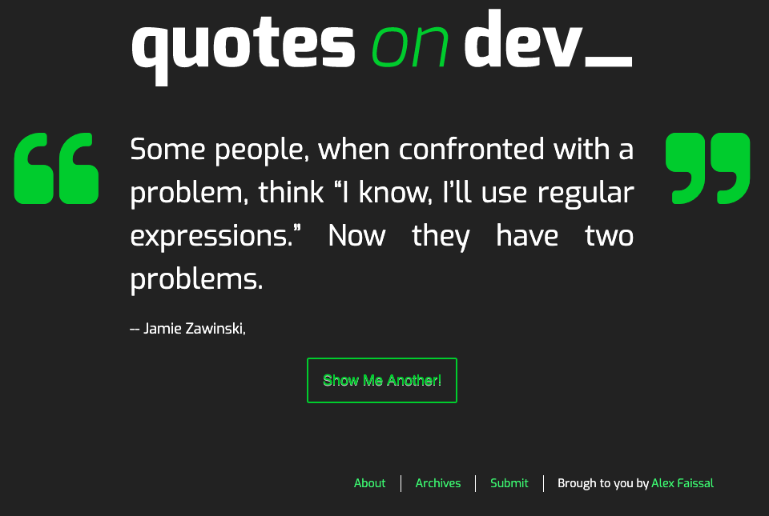
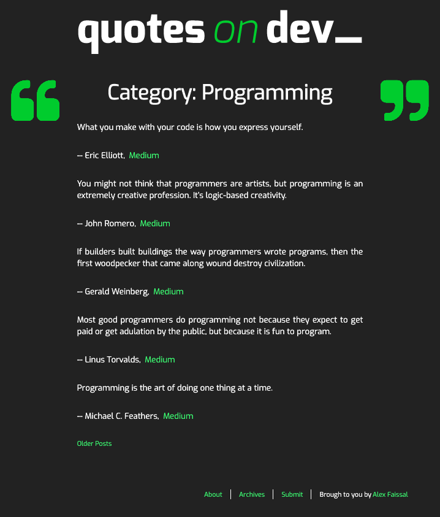
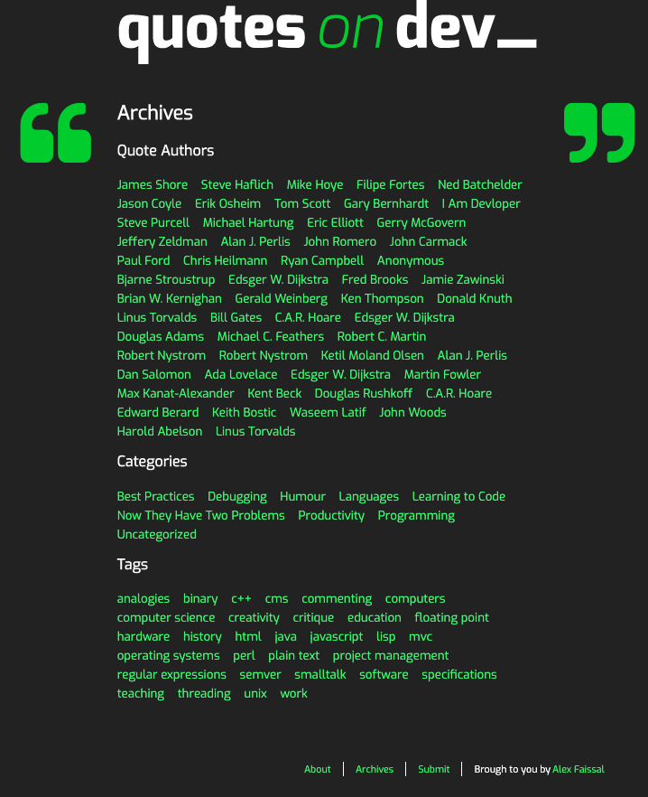
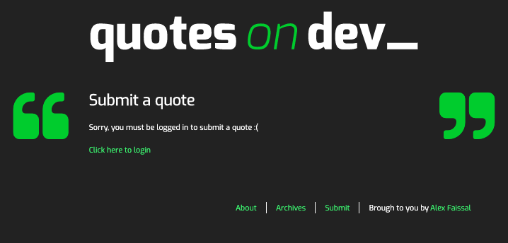
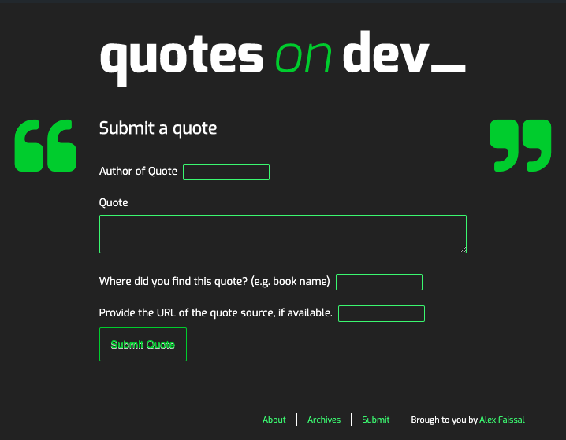

# Quotes on Dev 

A WordPress theme for the Quotes on Dev project 5 in the WD program in Red Academy.

## Work involved

### 1. JQuery

To create actions and functions to those actions

### 2. SASS

Responsive webpage for mobile, tablet and desktop.
Separated files for footer, header and main content.

### 3. WordPress

Diferent CSS, but optimized as much as possible, to cover several number of pages of WP, including index, archives and 404.

### 4. 404

Customized 404 using an image made in canva.com

